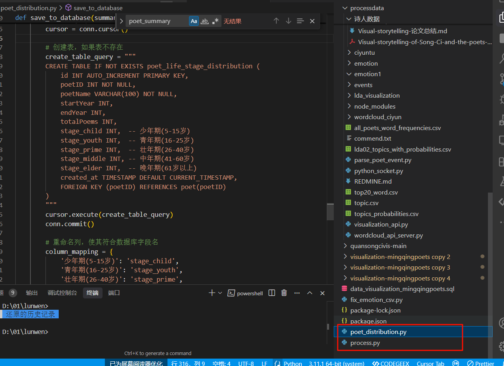
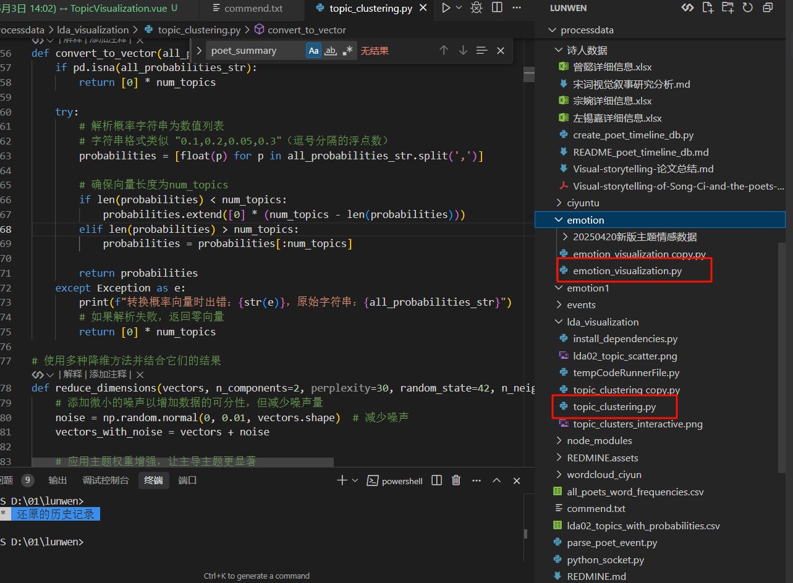
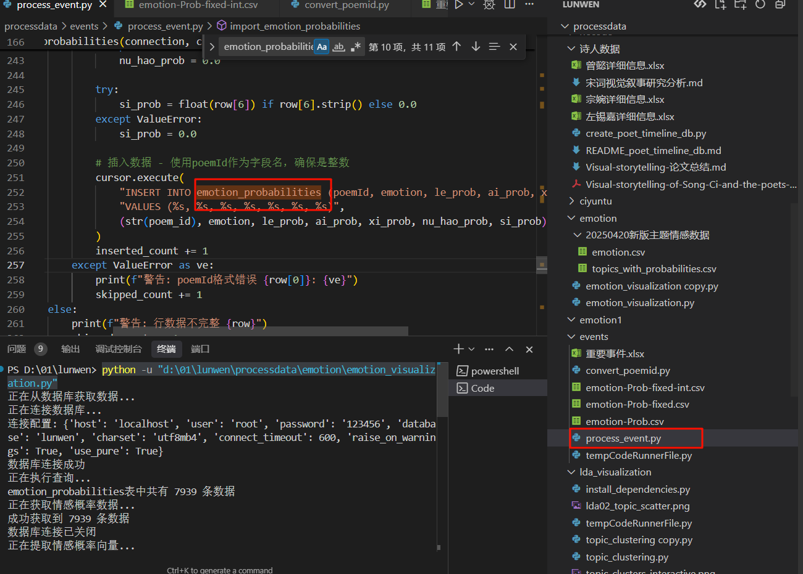
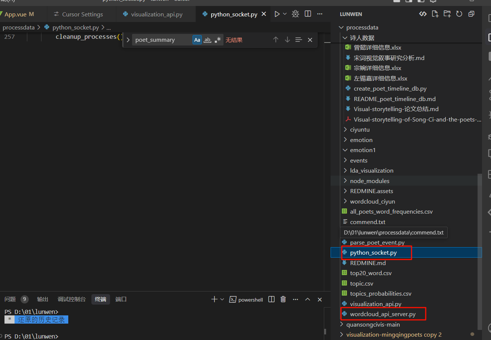
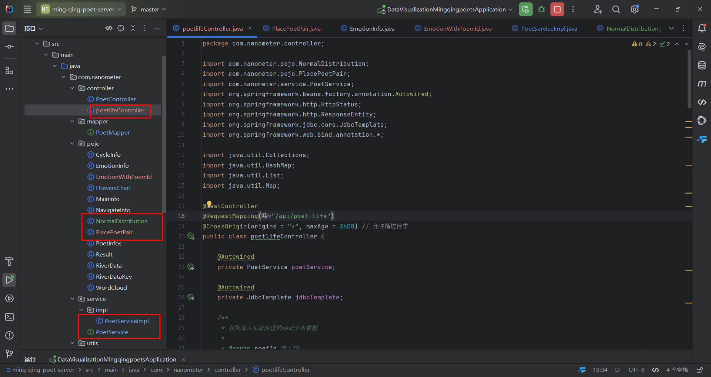
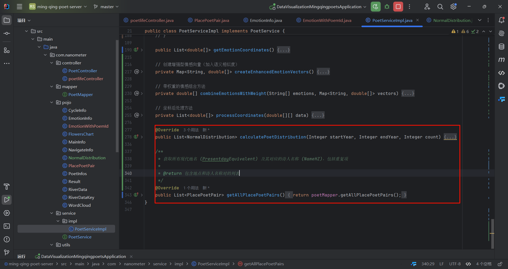
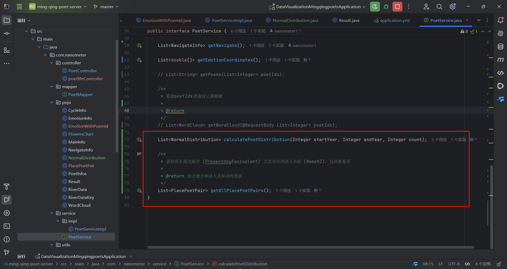

## 运行py脚本创建数据库

先运行这两个文件  一个是按时期的正态分布，一个后面java后端要用到的正态分布的数据库

然后还有就是散点图

python processdata/lda_visualization/topic_clustering.py --input="D:/01/lunwen/processdata/lda02_topics_with_probabilities.csv" --output="lda02_hdbscan.png" --min_cluster_size 80 --min_samples 8 --cluster_selection_epsilon 0.3 --point_size 15 --point_alpha 0.7

python -u "d:\01\lunwen\processdata\emotion\emotion_visualization.py"

另外还要运行一下这个文件process_event.py  创建一个情感概率的数据库

##  后端

后端是直接运行这两个py文件，后面还有一个java的按年正态分布的后端，直接把文件和相关代码嵌入到你的后端就行

应该是这些，到时候可以看看是不是有遗漏的

加了这两个函数

